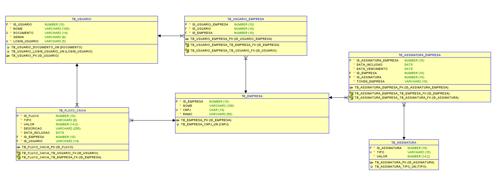
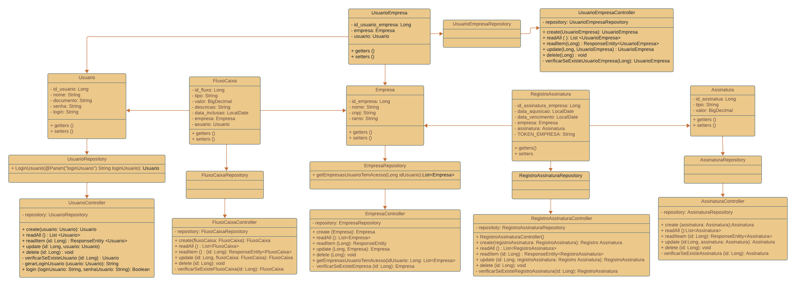

# SmartCash
    Camila Soares Pedra RM98246
    Gustavo Bertti RM552243
    Gustavo Macedo da Silva RM552333
    Rafael da Silva Camargo RM551127  
## Pitch
   https://www.youtube.com/watch?v=lk4khY2BL84

### Rodar aplicação
    1 - Abrir o link https://smartcashchallenge.azurewebsites.net 
### Como executar os testes
    Apenas o endpoint de login e criação de usuário não precisarão de autenticação, 
    os demais é necessário pegar o token gerado após fazer login e colocar no Auth. Passo a passo abaixo.
    Ir na aba "Auth" do aplicativo de API que estiver utilizando (Postman, Insomnia, Httpie) 
    selecionar o tipo Bearer Token e colocar o token gerado pela resposta de um login com sucesso
    Se não for feito os passos acima nenhum outro endpoint irá funcionar pois a aplicação entenderá que o 
    usuário não está autenticado.
    
## Exportar endpoints para aplicativo de API
    O arquivo com os endpoints está na pasta Documentos com o nome endpointParaTeste.
    Basta importar no aplicativo e começar os testes.

## Documentação da API com endpoints
    https://smartcashchallenge.azurewebsites.net/docs 

#### Diagrama entidade relacionamento

#### Diagrama de classes 
    Model RegistroAssinatura = entidade TB_ASSINATURA_EMPRESA

