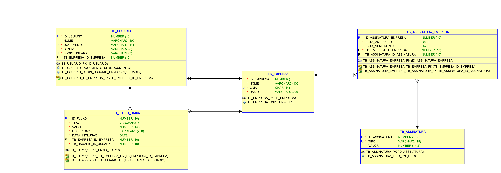

# SmartCash
    Camila Soares Pedra RM98246
    Gustavo Bertti RM552243
    Gustavo Macedo da Silva RM552333
    Rafael da Silva Camargo RM551127  
## Pitch
   https://www.youtube.com/watch?v=lk4khY2BL84
## Atividades realizadas
    Diagrama UML - Camila
    README.md - Rafael
    Controllers, models, repositorys, validation - Todos integrantes
### Rodar aplicação
    1 - Clonar o repositório para máquina local
    2 - Abrir o projeto
    3 - Rodar o comando no terminal .\mvnw spring-boot:run    
 
#### Diagrama entidade relacionamento

    TB_USUARIO
     FK TB_EMPRESA_ID_EMPRESA - representa a empresa do usuário

    TB_FLUXO_CAIXA
        FK TB_EMPRESA_ID_EMPRESA - representa a empresa do fluxo de caixa
        FK TB_USUARIO_ID_USUARIO - representa o usuário que registrou o fluxo de caixa

    TB_ASSINATURA_EMPRESA - Tabela de relação entre Assinatura e empresa (registros dessa tabela gravam uma empresa adquirindo uma assinatura)
        FK TB_EMPRESA_ID_EMPRESA - representa a empresa que adquiriu a assinatura
        FK TB_ASSINATURA_ID_ASSINATURA - representa qual assinatura foi adquirida 

#### Diagrama de classes 
    Model RegistroAssinatura = entidade TB_ASSINATURA_EMPRESA

## Endpoints
    [Documentação da API](http://localhost:8080/docs)