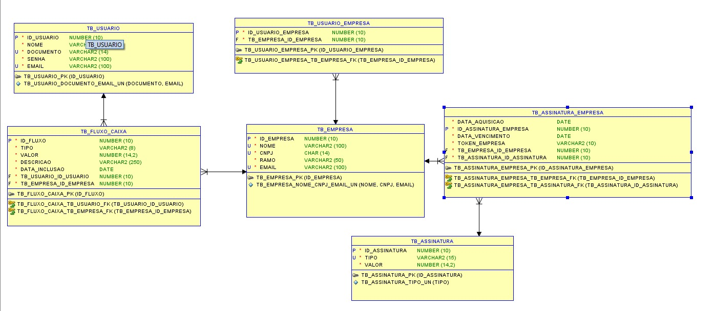
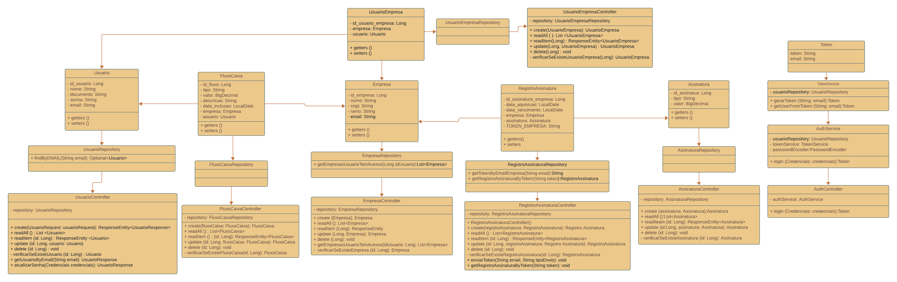

# SmartCash
    Camila Soares Pedra RM98246
    Gustavo Bertti RM552243
    Gustavo Macedo da Silva RM552333
    Rafael da Silva Camargo RM551127  
## Pitch
   https://www.youtube.com/watch?v=lk4khY2BL84
## Atividades realizadas
    Diagrama UML - Camila
    README.md - Rafael
    Controllers, models, repositorys, validation - Todos integrantes
### Rodar aplicação
    1 - Clonar o repositório para máquina local
    2 - Abrir o projeto
    3 - Rodar o comando no terminal .\mvnw spring-boot:run    
 
#### Diagrama entidade relacionamento

#### Diagrama de classes 
    Model RegistroAssinatura = entidade TB_ASSINATURA_EMPRESA

## Documentação da API com endpoints
    https://localhost:8080/docs